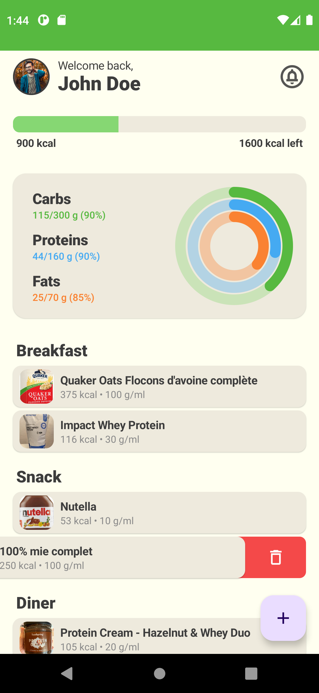
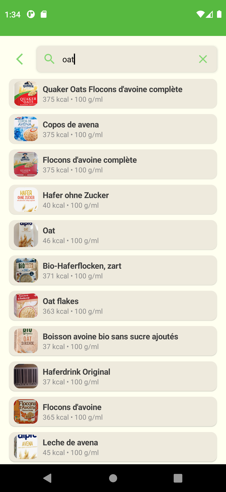
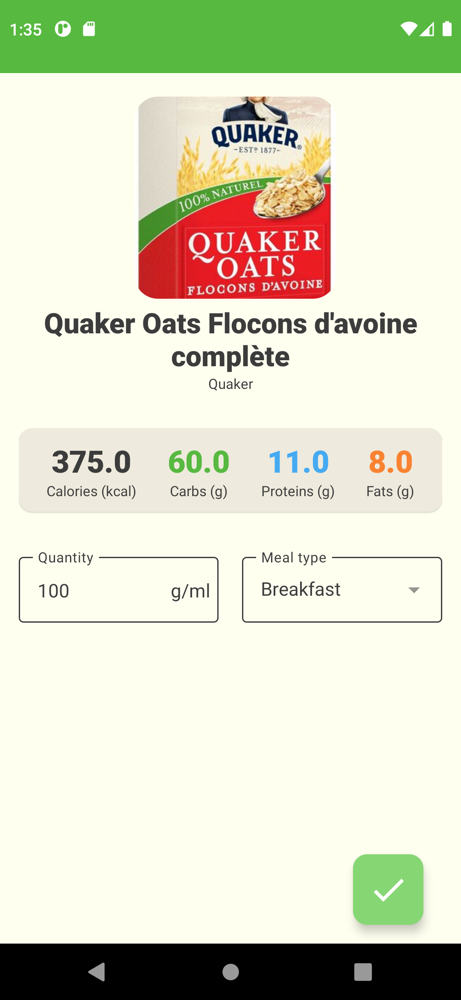

# Jetpack-Compose-Foodiez
Foodiez is a simple multi-modules jetpack compose app based on MVVM and clean architecture, that allows the user to fetch its products/meals and calculate his daily calories and macro nutriments.   
   
The data are reteived from an open source REST API : [Open Food Facts](https://fr.openfoodfacts.org/) 

## Project technical stack

This project takes advantage of best practices, and many popular libraries and tools in the Android ecosystem.

* [Kotlin](https://kotlinlang.org/)  
* [Jetpack Compose](https://developer.android.com/jetpack) - for the UI  
* [Coroutines](https://kotlinlang.org/docs/reference/coroutines-overview.html) - for background operations  
* [Hilt](https://dagger.dev/hilt/) - for dependency injection  
* [Retrofit2](https://square.github.io/retrofit/) - for network communications with REST APIs  
* [Coil](https://github.com/coil-kt/coil) - image loading library
* [MLKit](https://developers.google.com/ml-kit/vision/barcode-scanning) - for barcode scanning using Google's machine learning
* [Jetpack libraries](https://developer.android.com/jetpack):
   * [Navigation](https://developer.android.com/topic/libraries/architecture/navigation/) - in-app navigation
   * [Datastore](https://developer.android.com/jetpack/androidx/releases/datastore) - for storing data asynchronously
   * [Lifecycle](https://developer.android.com/topic/libraries/architecture/lifecycle) - perform an action when lifecycle state changes
   * [ViewModel](https://developer.android.com/topic/libraries/architecture/viewmodel) - store and manage UI-related data in a lifecycle conscious way
   * [Room](https://developer.android.com/jetpack/androidx/releases/room) - store offline cache   
   * [CameraX](https://developer.android.com/jetpack/androidx/releases/camera) - to access device camera

## Preview

 
  
  
  

